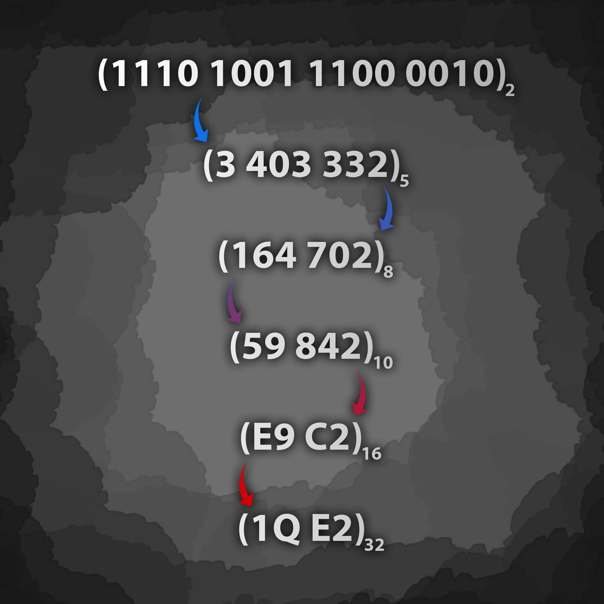

# ANY-TO-ANY - converts numbers between bases ; binary , decimal , octal , hexadecimal and muche more ..  
---
 
[](https://travis-ci.org/3imed-jaberi/any-to-any)

[](https://coveralls.io/github/3imed-jaberi/any-to-any?branch=master)

##### The purpose of this module is to convert numbers from any base to other base you want ..

###### **`NOTE:`** you can send to me for add anything you want in [instgram](https://www.instagram.com/3imed_jaberi/) ..

## Installation 
---

- NPM :
```bash
$ npm install any-to-any
```

## Usage 
---
 The method of use is simple and very easy ... Just follow these steps :
Step 1 : Import the module in this way .
```javascript
const { Convert } = require ('any-to-any') ;
```
Step 2 : Enter the input number  , the input base and the output base you want to the function .
```javascript
let InputNumber  = "1110111"; // 119 in decimal
let InputBase = 2 ;
let OutputBase = 8 ;
let result = Convert ( InputNumber , InputBase , OutputBase  );
console.log(`*****\n ${result} \n*****`);
```
Step 3 : Execute method to see the result ..
```bash
$your_pc_name_with_your_directory
*****
 167
*****
```
###### **`NOTE:`** in case the input number is consists of numbers only , you can enter the number to the function in number type .. so the step 2 will be :
```javascript
let InputNumber  = 1110111; // 119 in decimal
let InputBase = 2 ;
let OutputBase = 8 ;
let result = Convert ( InputNumber , InputBase , OutputBase  ); 
console.log(`*****\n ${result} \n*****`);
```

## Examples
----
###### Some possibilities ... 
 

###### The result ...
 

## Some Informations :
---
Switching between bases numbers is becoming easier with this module .. 
This module can convert the integers numbers between base 2 & base 36 and soon it will be possible to convert real numbers ... 

#### What new in the future ? 
---
 Develop the module more on the conversion in the large bases ...

#### License
---
[MIT](https://choosealicense.com/licenses/mit/) 

